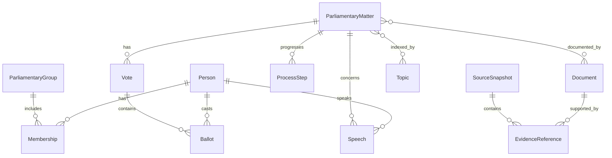
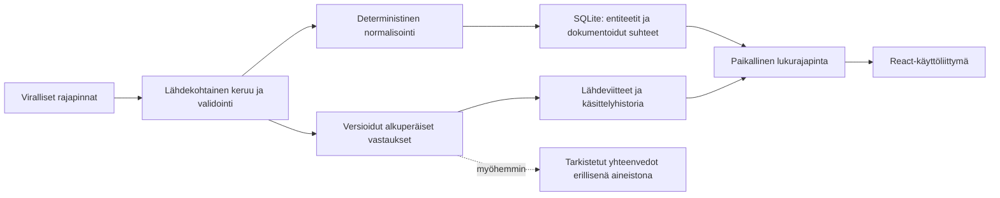

# Eduskuntadata: tuotteen ja toteutuksen perusta

Päätökset 2.10.2026. Lähtörepo sisälsi README:n. Toteutettu tietoperusta, paikallinen lukurajapinta ja suomenkielinen React-käyttöliittymä. Julkinen käyttöönotto seuraa myöhemmin. Sama dokumentoitu toimintaverkosto palvelee henkilöitä, aiheita, päätöksiä ja asiayhteyden jäljittämistä.

## 1. Tuotepäätös ja ensimmäinen ydinkokemus

Käyttäjä saapuu nimellä, uutisen aiheella tai asiakirjatunnuksella. Palvelu auttaa löytämään tapahtuman ja avaa sen taustalla olevan aineiston. Tärkein onnistuminen on, että käyttäjä ymmärtää mitä päätettiin ja pystyy tarkistamaan sen lähteestä. Edustajia ei pisteytetä eikä palvelu suosittele äänestysvalintaa.

Ensimmäinen päästä päähän rakennettava näkymä on asian jäljitys, henkilöprofiilin rinnalla. HE 74/2023 vp toimii oikeana testitapauksena. Sen viisi eri äänestystä näyttävät konkreettisesti, miksi yksi ”kannatti asumistukileikkauksia” -leima olisi liian karkea.

Nykyinen perusta tuottaa käsittelytiedot, dokumentit, lähteen ilmoittaman lopputuloksen ja yksittäiset äänet. Selkokielistä asiayhteenvetoa, uutisväitteiden vastaavuuksia tai poliittisia johtopäätöksiä ei tässä vaiheessa keksitä.

## 2. Tietomalli ja suhteet

Entiteetin tunnus koostuu lajista ja lähteen pysyvästä tunnuksesta. Ihmiselle käytetään `henkilonro`, asialle eduskuntatunnusta, asiakirjalle `edktunnus`, äänestykselle sen omaa `id`:tä ja viralliselle asiasanalle YSO-URI:a. Asian ja asiakirjan tunnukset pidetään erillään, vaikka molemmissa näkyisi HE 74/2023 vp.

| Entiteetti | Suhteet ja olennainen ajallinen tieto | Nyt |
| --- | --- | --- |
| Person | Edustajakaudet, määräaikaiset Group- ja District-jäsenyydet, puheen puhuja, äänimerkin henkilö | Tuotu |
| ParliamentaryGroup | Ryhmän lähdetunnus ja nimi; erillinen Party-entiteetistä | Tuotu henkilötietojen kautta |
| ElectoralDistrict | Historialliset tunnukset ja henkilön kuuluminen vaalipiiriin | Tuotu henkilötietojen kautta |
| ParliamentaryMatter | Aloitus, tila, käsittelyvaiheet, lopputulos, ehdotukset, dokumentit, äänestykset | Yksi todellinen asia tuotu |
| ProcessStep | Asia, lähteen käsittelytunnus, tapahtumapäivä, järjestys, valiokunta ja alkuperäinen kuvaus | Tuotu |
| Document | Pysyvä EDK-tunnus, julkinen asiakirjatunnus, tyyppi, kieli, lähteen teksti ja julkaisuajankohta | Tuotu |
| Vote | Asia, kysymys/otsikko, käsittelyvaihe, mitätöintitieto, lähteen summat | Tuotu |
| Ballot | Vote + henkilönumero; lähteen valinta, eduskuntaryhmä ja vaalipiiri juuri kyseisessä äänestyksessä | Tuotu |
| Speech | Puhe, puhuja-ID, asia-ID, pöytäkirjakohta ja aika | Kaksi oikeaa hakutulosnäytettä; kattava tuonti tekemättä |
| Topic | Virallinen YSO-asiasana tai myöhemmin erillinen toimituksellinen aihe | Viralliset asiasanat tuotu |
| Party | Puolue, erikseen tarkistetut suhteet eduskuntaryhmiin | Suunniteltu |
| Committee | Pysyvä valiokuntatunnus, jäsenyydet, dokumentit ja julkiset käsittelyvaiheet | Tieto säilytetty käsittelyvaiheissa; oma näkymä myöhemmin |
| Proposal / Initiative / Amendment | Asian tai dokumentin tyyppi; aloitteentekijät ja allekirjoittajat omissa rooleissaan | Aloitetiedot ja säädösviitteet säilytetty; erillinen normalisointi myöhemmin |
| Question / Answer | Kysymyksen ja vastauksen dokumentti/puhe, lähteen eksplisiittinen suhde, tarkistettu jakaminen osakysymyksiin | Suunniteltu |
| FundingRecord | Ilmoitus, vaali, ehdokas/puolue, raharivi, ilmoitusversio ja henkilökytkennän todiste | Tutkittu, ei tuotu |
| LobbyingRecord | Ilmoittaja, raportointikausi, ilmoitettu aihe, kohteet, menetelmät, versio | Tutkittu, ei tuotu |
| Statute | Finlex-tunnus, kieli, ajallinen versio ja voimaantulo | Yksi lähdelinkki kokeiltu; tuonti myöhemmin |

Aluksi SQLite säilyttää tyypitetyt entiteetit JSON-attribuutteineen ja rajoitetun joukon lähteeseen perustuvia suhteita. Käsittelyvaiheilla ja äänimerkeillä on omat taulut. Tämä mahdollistaa yhteiset hakutulokset ja jäljityksen ilman erillistä graafitietokantaa. Relaatiotietokanta tukee verkostoa; verkosto ei edellytä Neo4j:tä.

Person → Group -suhde sisältää alkamis- ja päättymisajan. Äänimerkin ryhmä säilytetään suoraan äänestyslähteestä; sitä ei korvata edustajan nykyisellä ryhmällä. Tuomatta jäänyt henkilö-ID on ratkaisematon viite, ei automaattisesti nimen avulla luotu profiili.

## 3. Näyttö ja luottamus

Jokaisella normalisoidulla tietueella ja suhteella on lähdesnapshot sekä JSON Pointer sen alkuperäiseen kohtaan. Snapshot säilyttää URL:n, HTTP-menetelmän, mahdollisen hakurungon, vastauksen sellaisenaan, tiivisteen, hakuaikaleimat ja lisenssin. Muuttunut vastaus saa uuden snapshotin; sama vastaus päivittää viimeisen hakukerran. Tiiviste todentaa paikallisen aineiston eheyden, ei ole viranomaisen digitaalinen allekirjoitus.

Neljä alkuperälajia pidetään erillään:

| Laji | Näyttöperiaate | Vaadittu metadata |
| --- | --- | --- |
| Virallinen tieto | ”Eduskunnan aineisto” | Tuottaja, tietue/katkelma, aika, lisenssi |
| Johdettu laskenta | ”Laskettu aineistosta” | Menetelmäversio, rajaus, nimittäjä, syötetiedot |
| Toimituksellinen luokitus | ”Palvelun aiheluokitus” | Luokittelusääntö ja linkin perustelu |
| AI-yhteenveto | ”AI:n laatima yhteenveto” | Malli/prompt-versio, lähdekatkelmat, tarkistustila |

Nyt toteutuksessa on virallisen datan deterministinen normalisointi ja yksi erikseen johdetuksi merkitty laatutarkistus: `ballotCountCheck` vertaa toimitettujen äänimerkkien määrää lähteen ilmoittamaan kokonaismäärään. Puuttuva lista tuottaa tuntemattoman tarkistustuloksen, ei varmaa nollaa. Määrien yhtäläisyys ei osoita koko historian kattavuutta. AI:ta ei tarvita henkilö- tai äänitietojen siirtämiseen. Myöhemmät yhteenvedot tallennetaan erilliseen tuotostauluun, eivät alkuperäisen dokumentin päälle.

Käyttöliittymän kerrokset ovat ”Mitä tapahtui?”, ”Mihin tämä perustuu?” ja ”Avaa alkuperäinen aineisto”. Jos yhteenveto ei ole vielä tarkistettu, käytetään alkuperäistä otsikkoa ja lyhyttä termiselitystä. Epävarmuus koskee tiettyä väitettä, ei epämääräisesti koko profiilia.

## 4. Informaatioarkkitehtuuri ja navigaatio

Päänavigaatio: **Tutki**, **Edustajat**, **Aiheet**, **Päätökset**, **Vaikuttaminen**. Yhteinen haku on aina saatavilla. ”Lähteet ja menetelmät” on pysyvä luottamuslinkki. ”Tutki” on Context / Trace -kokemuksen suomenkielinen nimi.

| Reitti | Käyttäjän kysymys | Sisältö |
| --- | --- | --- |
| `/` ja `/tutki?q=…` | Mitä tässä uutisessa tai asiassa tapahtui? | Haku ja löydetyt mahdolliset asiayhteydet |
| `/haku?q=…` | Mitä aiheesta löytyy? | Ryhmitellyt henkilöt, asiat, aiheet, puheet, asiakirjat ja äänestykset |
| `/edustajat/:id` | Mitä tämä henkilö on tehnyt? | Yhteenveto, äänet, puheet, aloitteet/kysymykset, aikajana ja myöhemmin ilmoitetut sidonnaisuudet |
| `/aiheet/:id` | Mitä tästä aiheesta käsitellään? | Lähdeperustaiset asiat, niihin liittyvät tapahtumat ja henkilöt |
| `/asiat/:id` | Miten asia eteni ja mitä päätettiin? | Prosessin aikajana, eri ehdotukset, äänestykset ja lähteen lopputulos |
| `/aanestykset/:id` | Mistä vaihtoehdoista äänestettiin? | Otsikko, vaihtoehtojen tekstit, yksittäiset äänet ja asiayhteys |
| `/vaikuttaminen` | Mitä virallisia ilmoituksia löytyy? | Rahoitus ja lobbaus erillisinä aineistoina |
| `/lahteet` | Kuinka kattavaa ja tuoretta tieto on? | Aineistokohtainen kattavuus, viimeinen onnistunut tuonti, puutteet ja menetelmät |

Keskeneräistä aluetta ei julkaista tyhjänä näennäistoiminnallisuutena. Näkymä ”Vaikuttaminen” voi avautua vasta ensimmäisen luotettavasti yhdistetyn lähteen jälkeen. Puolueita tutkitaan henkilö- ja äänestysnäkymien kautta; erillinen puoluesivu lisätään tarpeen mukaan.

## 5. Ensimmäiset käyttäjäpolut

1. **Uutisesta asiaan:** käyttäjä hakee ”asumistuki” → näkee erotettuna eri vuosien esitykset → avaa yhden asian → lukee mitä lähde ilmoittaa lopputulokseksi → avaa äänestyksen ja sen alkuperäiset vaihtoehdot → tarkistaa asiakirjan. Hakutulos on mahdollinen yhteys uutiseen, ei uutisväitteen automaattinen vahvistus.
2. **Nimestä tekoihin:** käyttäjä avaa henkilön → valitsee aiheen ja ajan → näkee äänet, aloitteet ja puheet erillisinä → avaa tapahtuman asiayhteyden. Suodatettu aineisto ja sen puutteet näkyvät ennen vertailua.
3. **Aiheesta prosessiin:** käyttäjä avaa aiheen → näkee käsittelyssä olevat ja päättyneet asiat → selvittää muutosehdotukset ja äänestykset. Aihekytkennän ”Miksi mukana?” näyttää virallisen asiasanan tai palvelun luokitteluperusteen.
4. **Tunnuksesta lähteeseen:** HE-/KK-/LA-tunnus ohittaa epämääräisen tekstiosuvuuden → asia tai dokumentti avataan suoraan → lähteen puuttuessa näytetään ”Aineistoa ei ole vielä tuotu”, ei ”Asiaa ei ole olemassa”. Nykyinen CLI ja lukurajapinta toteuttavat tämän perustan HE-testiasialle.

Kysymys/vastaus-analyysi ja vaaleja edeltävä henkilövertailu käyttävät samaa aineistoa myöhemmin. Vastauksen puuttumishavainto on rajattava tarkastettuun tekstiin ja osakysymykseen; ”väisteli” ei ole sallittu automaattinen tulos.

## 6. Tekninen arkkitehtuuri

**Nyt:** Node.js, natiivi `fetch`, `node:sqlite`, `node:test`, ei uusia ajonaikaisia riippuvuuksia. HTTP-palvelu kuuntelee vain `127.0.0.1`:ssä. Tiedonkeruu tapahtuu CLI:stä eikä käyttäjän jokaisen haun yhteydessä. Samat Store-lukufunktiot palvelevat hakua, profiilia ja Tracea. Julkisen sivuston selaimen pitää käyttää omaa lukurajapintaa, ei kuormittaa viranomaislähteitä suoraan.

**Käyttöliittymä:** React + Vite, suomenkieliset ydinnäkymät ja lähteen ruotsinkielisen tekstin säilyttäminen tietomallissa. Natiivit hyperlinkit ja GET-lomakkeet pitävät osoitteet ja selaimen navigaation toimivina ilman reititinkirjastoa. Pitkän asiakirjan AI-yhteenveto on valinnainen jatko, ei ydinkäytön vaatimus.

**Julkaisuun mennessä:** tuonti ajastetaan, kattavuus mallinnetaan lähde- ja ajanjaksotasolle. Nyt koko monipyyntöinen tuonti kirjoitetaan yhtenä SQLite-transaktiona vasta onnistuneen keruun ja normalisoinnin jälkeen. Aiempi aineisto säilyy haku- ja tallennusvirheessä. Tuontiloki ja käyttöliittymä näyttävät epäonnistumisen. Vastaukset säilyvät keruun ajan muistissa; tämä riittää rajattuun MVP-tuontiin. Katkennut prosessi voi jättää lokitilan `running`: seuraava askel on keskeytyneiden ajojen tunnistaminen.

Tietokanta kannattaa siirtää Postgresiin vasta, kun julkisen palvelun samanaikainen käyttö, päivitykset tai hakuaineiston koko edellyttävät sitä. Uusi hakupalvelu tai vektorikanta ei ole ensimmäinen ratkaisu. Nykyinen haku on rajattu, kirjainkoon huomioimaton AND-merkkijonohaku, ei suomen kielen taivutusmuotoja ymmärtävä tuotantohaku.

Uutis-URL:n hakemista ei vielä sallita. Sen toteutus tarvitsee verkkosisällön oikeudet, turvalliset palvelinpuolen URL-rajat ja todisteiden yhdistämisen. Nyt lukurajapinta ei hae mitään käyttäjän antamasta URL:sta.

## 7. Suora ja johdettu tieto

| Suoraan lähteestä | Johdettu käsittely | Rajaus |
| --- | --- | --- |
| Henkilö-ID, kaudet, jäsenyydet | Ajankohtaan perustuva jäsenyyden valinta | Ei päätellä puoluetta nykyisestä ryhmästä |
| Äänivalinta ja äänestysotsikko | Äänimäärät, osuudet, ryhmäpoikkeama | Nimittäjä, pidättäytymiset, poissaolo, puhemies ja mitätöinti näkyviin |
| Käsittelyvaiheet ja asiakirjaviitteet | Aikajärjestys, selkokielinen vaihe | Tapahtuma-aika erilleen julkaisusta |
| YSO-asiasanat | Laajemmat aihekokonaisuudet | Peruste säilytetään jokaiselle luokitukselle |
| Puheiden ja vastausten teksti | Katkelmat, yhteenveto, osakysymysten vertailu | Lähdekatkelma ja tarkistustila, ei motiivien tulkintaa |
| Rahoitus- ja lobbausilmoitukset | Henkilöiden vastaavuudet ja rahasummien aggregointi | Vastaavuus tarkistetaan; ei kausaalipäätelmiä |

## 8. Riskit ja toteutuksen rajat

- **Äänestysvaihtoehdot:** ”Jaa” voi tarkoittaa mietinnön hyväksymistä jonkin vastaehdotuksen sijaan. Varsinaiset vaihtoehtotekstit on poimittava pöytäkirjasta ennen selkokielistä kannatusväitettä. Nykyinen perusta säilyttää otsikon, käsittelykontekstin ja raakavalinnan.
- **Historia:** aineiston aukko ei ole toiminnan puuttuminen. Sama ehdokasnumero eri vaaleissa tai samanniminen henkilö ei ole sama henkilö.
- **Säädöksen nykytila:** esitys, eduskunnan päätös, lain vahvistaminen ja nykyinen voimassaolo ovat eri tapahtumia. Finlex-versio tarvitaan viimeiseen.
- **Puheenvuorot:** tekstin aiheosuma ei tarkoita, että puhe käsittelisi juuri etsittyä lakia. Kirjallisen kysymyksen vastaus ja täysistuntopuhe eivät ole sama tietolaji.
- **Tietuekorjaukset:** perusta päivittää yhden tietueen suhteet, vaiheet ja äänet. Koko lähdeaineistosta poistuneiden tietueiden havaitsemista ei vielä toteutettu. Ennen julkista käyttöä tarvitaan tuontiversioiden vertailu ja peruutettujen tietojen näyttö.
- **Lisenssit:** vaalirahoituksen lisenssi on vahvistamatta. Jokainen integraatio saa oman lähderekisteritietonsa; Eduskunnan lisenssi ei automaattisesti kata VTV:n eri aineistoa.
- **Henkilötiedot:** paikalliset snapshotit voivat sisältää henkilölähteen yhteystietoja. Julkinen lukumalli ei palauta niitä. Älä julkaise tietokantaa tai raakadumppia. Säilytys ja tarpeettomien henkilötietojen käsittely ratkaistaan ennen julkista jatkuvaa keruuta.
- **Kattavuus käyttöliittymässä:** nykyiset määrät ovat paikallisen tuonnin määriä. Profiilin tyhjää äänestyslistaa ei saa kuvata ”ei äänestänyt” -väitteenä. Tuontitila, valittu aika ja aineistolaji näkyvät aina.
- **Käyttöliittymän perusvaatimukset:** näppäimistöllä toimiva haku, näkyvä fokus, semanttinen aikajana, toimiva mobiiliasettelu ja tekstin avulla erotettavat äänivalinnat. Poliittisia valintoja ei koodata pelkkään punaiseen/vihreään.

## 9. Toteutusjärjestys ja onnistumisen tarkistus

1. **Tehty:** lähteiden tutkimus, pysyvät tunnukset, snapshotit/lisenssit, sivutettu henkilökeruu, yhden asian ketju, asiakirjat ja äänet; paikallinen haku, Trace-, profiili-, aihe-, äänestys- ja listausrajapinnat. 12 offline-testiä ja oikea kokonainen henkilötuonti. Käyttöliittymän tutkimuspolku ja mobiiliasettelu on varmennettu selaimessa.
2. **Seuraavaksi:** poistuneiden tietueiden käsittely, keskeytyneiden ajojen tunnistaminen, kattavuuden mallintaminen aineisto/ajanjakso-tasolla ja äänestysvaihtoehtojen dokumenttipoiminta. Samalla rajattu uusi asiatuonti ja puhehaun oikean rajauksen varmistus. Koko tuonnin atominen kirjoitus on toteutettu.
3. **Ensimmäinen julkinen kokemus:** paikallinen haku → asia → äänestys → lähde sekä henkilöprofiili on toteutettu. Ennen julkaisua tehdään käytettävyyskoe: käyttäjä selittää, mistä äänestettiin ja löytää alkuperäisen vaihtoehdon ilman apua. Vaihtoehtotekstien puuttuminen näkyy nykyisessä näkymässä.
4. **Aiheet ja dokumentoitu toiminta:** YSO:n toimitukselliset yläaiheet, puheet, kirjalliset kysymykset, aloitteet ja roolikohtaiset henkilökytkennät. Luokittelun perustelut näkyvät.
5. **Lopputulos ja vaikuttaminen:** Finlex-voimassaolotiedot, tarkistetut rahoitus- ja lobbauskytkennät sekä oma aineistokattavuus jokaiselle. Ei kausaalista visualisointia yhteyden ja äänen välille.
6. **Avustavat yhteenvedot ja vaalitutkiminen:** lähdekatkelmaan sidotut yhteenvedot ja käyttäjän valitsemiin aiheisiin perustuva rinnakkainen todistusaineisto. Ensikertalaisilla ehdokkailla parlamentaarisen historian puuttuminen merkitään, eikä kampanjalupausta rinnasteta tekoon.

Ensimmäiset analytiikkakysymykset: löydetäänkö haulla avattava asia, pääseekö käyttäjä äänestyskontekstiin ja käytetäänkö lähteen tarkistuspolkua? Mahdolliset tapahtumat ovat `search_result_opened`, `vote_context_opened` ja `source_opened`, aineistolajeilla ja tulosmääräluokilla. Hakutekstejä, poliittisten kiinnostusten henkilöprofiileja tai uutis-URL:ja ei kerätä oletuksena. Lähteen avaamisen määrä on käytön signaali, ei todiste ymmärtämisestä; ymmärtäminen tarkistetaan käyttäjäkokeilla.
